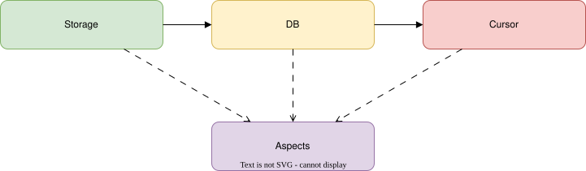
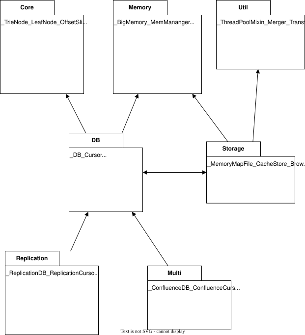

# Leaves Architecture

This document describes the overall architecture of Leaves before diving into per-subsystem implementation details.

## Scope and audience

This document is for developers and contributors who need a system-level model of Leaves components, boundaries, and design intent.

## Design principle: mechanism and policy separation

Leaves enforces a strict split between mechanism and policy:

- Mechanisms are provided by Leaves: trie storage, transaction flow, replication FSMs, serialization, and merge plumbing.
- Policies are provided by applications: consistency semantics, conflict resolution, merge behavior, and transport choices.

This separation is central to the architecture and appears in all subsystem interfaces.

## General Overview



Major components:

- Storage layer: memory-mapped, browser persistence backends.
- Every Storage can hold multiple databases.
- Every Database can hold multiple cursors.
- Extensibility layer: Aspects and handler/policy hooks.

In C++ multiple Database type are provided:

- `MapStorage::DB`  a non replicable single writer database, that provides ACID and Two-Phase Commit semantics.
- `MapStorage::ReplicationDB` like `DB` but adds replication support.
- `MapStorage::ConfluenceDB` a multi-writer database that provides simultaneous multi writing.
- `MapStorage::ConfluenceReplicationDB` like `ConfluenceDB` but adds replication support.

## Public and Internal types

The public API is a facade over the internal types.  Public types are defined in `include/leaves/*.hpp` and internal types are defined in `include/leaves/intern/*/*.hpp`.  Internal types are not part of the public API and may change without notice.


## Internal Subsystems



- DB contains trie-manipulation and transactional database machinery, including _DB, _Cursor, _Inserter, _Deleter, and aspect integration via DefaultAspect.
- Core contains low-level shared primitives used across subsystems, including _TrieNode and _LeafNode layouts, pointer/offset traits, and Slice/value utility types.
- Memory contains allocation and reclamation infrastructure, including _BigMemory, _MemManager, _GarbageSlot, Area, and AreaPool for page and big-value lifecycle management.
- Util contains reusable cross-cutting helpers such as _ThreadPoolMixin, _Merger, and _TransferTrie that support parallel work, merge flows, and transfer serialization.
- Storage contains backend implementations and persistence adapters, including _MemoryMapFile, _CacheStore, and _BrowserStore, plus backend-specific helpers for DB directory and WAL integration.
- Multi contains Confluence multi-writer internals, including _ConfluenceDB, _ConfluenceCursor, and _TributaryDB for tributary coordination and merge orchestration.
- Replication contains replication-aware wrappers and protocol state machines, including _ReplicationDB, replication cursors, _HashUpdater, ReplicationSenderFSM, and ReplicationReceiverFSM.


## Node Types

The trie structure in Leaves is composed of two fundamental node types, working together to provide both efficient navigation and compact storage.

### _TrieNode: Sparse Bitmap Trie Node

The `_TrieNode` is the internal navigation node of the trie tree. It uses a **two-level bitmap indexing** scheme to achieve sparse storage without wasting memory on a full 256-entry pointer array.

#### Structure

- **Header (8-11 bytes)**:
  - `hash`: optional inline hash for validation.
  - `_array_len`: branch count in upper 15 bits; bit 15 is NULL_MASK flag.
  - `_upper`: 8-bit bitmap indicating which of 8 groups (ranges 0-31, 32-63, …, 224-255) have branches.
  - `_compressed_len`: length of the compressed prefix.
  - `_lower_offset`, `_array_offset`: byte offsets to variable sections.
  - `_compressed_data[]`: variable-length prefix bytes.

- **Lower bitmaps (0-64 bytes)**: Up to 8 × 32-bit bitmaps, one per active group in `_upper`.

- **Offset array (0-2KB)**: Only entries for branches that actually exist (sparse).

#### Key Design Decisions

- **Sparse indexing**: Stores offsets only for branches that exist, avoiding the 2KB overhead of a full 256-entry array per node.
- **Two-level bitmaps**:
  - `_upper` (8-bit): Which of 8 groups are present.
  - `_lower[]` (32-bit each): For each active group, which of the 32 bytes within that group have branches.
- **Compressed prefix**: Each node stores a prefix string to reduce tree depth and avoid redundant branching.
- **Alignment optimization**: The lower bitmap array is padded to align the offset array, improving cache locality during lookups.

#### Navigation (O(1) lookup)

1. Extract upper index: `ubit(c) = c >> 5` (which of 8 groups).
2. Check if the group exists in `_upper`.
3. If yes, extract lower index: `lbit(c) = c & 0x1F` (which of 32 bits in the group).
4. Check the bit in the corresponding `_lower[]` entry.
5. If set, compute the array index using popcount on preceding lower bitmaps.
6. Return the offset from the offset array.

Lookup is three bitmap checks + one array access: fast and cache-efficient.

### _LeafNode: Key-Value Storage

The `_LeafNode` stores the actual key-value pairs at the leaves of the trie.

#### Structure

- **Header (4-6 bytes)**:
  - `value_size`: 16-bit size; high bit (`BIG_VALUE_FLAG`) indicates out-of-line storage.
  - `key_size`: 8-bit key length.
  - `hash`: optional inline hash for validation.

- **Data (variable)**:
  - `key[key_size]`: raw key bytes.
  - `value[vsize()]`: raw value bytes (inline or reference).

#### Value Storage Strategy

- **Inline values**: Small values (below a calibrated threshold) are stored directly in the leaf node.
- **Big values**: Values above the threshold are stored separately in the memory manager, with a reference (`BIG_VALUE_FLAG` + offset) stored in the leaf.
- **Copy-write threshold**: Automatically calibrated during database creation to balance memory usage and I/O performance.

### Node Relationships

```
_TrieNode (internal)
    |
    |-- offset_array[0] ──→ child _TrieNode or _LeafNode
    |-- offset_array[1] ──→ child _TrieNode or _LeafNode
    `-- offset_array[N] ──→ child _TrieNode or _LeafNode

_LeafNode (leaf)
    `-- (key, value pair)
```

- Internal nodes (`_TrieNode`) store offsets to children, which may be other internal nodes or leaf nodes.
- Leaf nodes (`_LeafNode`) store the actual data.
- The choice between internal and leaf nodes is determined at insertion time based on key overlap and compression.

### Memory Layout and Copy-on-Write

Both node types are stored in pages managed by the memory allocator:

- Nodes are immutable once written to a committed page.
- Writes trigger copy-on-write: modifications create a new node in a writable page.
- In-place mutations (`insert_branch()`) are permitted only on pages in the current write transaction, where no concurrent readers can observe intermediate states.

This design ensures ACID semantics and multi-process safety without per-node locks.

