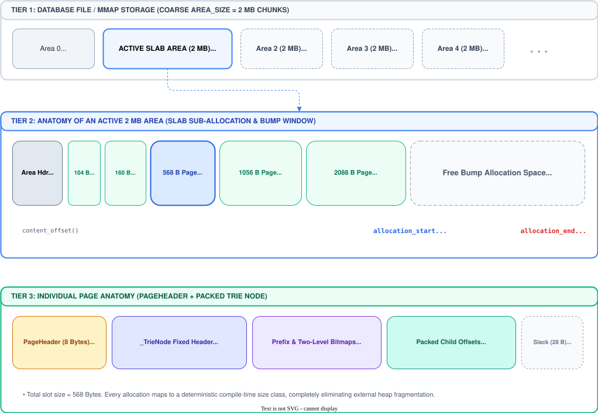
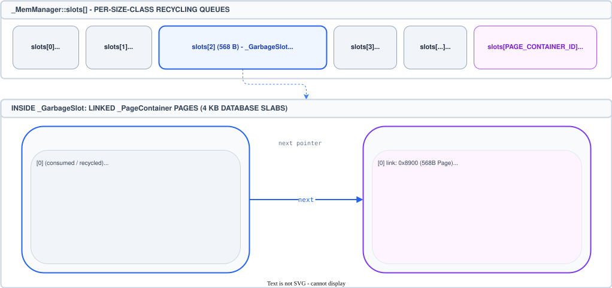
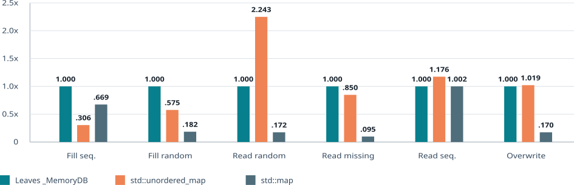
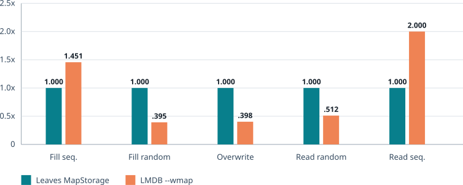

# A New Concept for Key-Value Stores

Most embedded key-value stores are built around a small family of storage structures: B-trees, B+ trees, LSM trees, and hash tables. Tries are usually reserved for routing tables, dictionaries, autocomplete, and specialized string indexes.

This article examines whether a suitable trie variant can outperform conventional key-value-store layouts.

## Why tries are not used as databases

A [trie](https://en.wikipedia.org/wiki/Trie) is a search tree whose path is determined by the symbols of a key. For byte strings, each step consumes one byte. This gives tries several appealing properties for key-value storage.

Lookup depends on key length only, $O(k)$, rather than directly on the number of stored records. A search does not compare the requested key with separator keys at every tree level or rely on collision handling. Common prefixes are shared structurally, and ordered traversal follows naturally when child edges are kept in byte order.

Those properties alone do not make a practical database.

The conventional database answer is the [B-tree](https://en.wikipedia.org/wiki/B-tree), or, more commonly, the [B+ tree](https://en.wikipedia.org/wiki/B%2B_tree). A lookup typically takes $O(\log n)$ page-level comparisons, and only a few page reads when each internal page holds many separator keys and child pointers. This high fanout keeps the tree shallow, while packed neighboring keys make sorted iteration efficient. B-trees were designed around slow storage and fixed-size pages, so each page is organized to bring many useful keys into memory at once rather than paying for one record at a time. Their strength is therefore not only predictable access time but also economical use of each page: most of the space fetched from storage contributes to the search.

A naive trie loses this comparison. A byte trie can have up to 256 branches per internal node. If every node stores a full 256-entry pointer array, most entries will usually be empty. The database then pays for absence: memory and disk space are reserved for byte values that have no branch. A 256-entry array of 8-byte links uses 2 KiB per node, even when only a few branches are present.

The central problem is therefore space. The direct addressing that makes a trie attractive also creates a sparse node representation. This can be acceptable for in-memory dictionaries, and prefix semantics can justify the cost in specialized domains such as IP routing. For a general persistent key-value store, unused child slots and extra node reads are a substantial tax.

Compressed tries, radix trees, Patricia trees, and adaptive radix trees address parts of this problem by compressing empty paths, reducing child storage, or selecting node formats according to density. These techniques do not solve the general space problem on their own: linked-list or map-of-children representations avoid reserving unused child slots, but introduce pointer chasing, variable node layouts, and poorer locality, while long keys can still create chains of single-child nodes that turn one logical key into many stored nodes.


## Two-Level Bitmap Compression Solves the Space Problem

A new variant of trie node is a hybrid structure that combines a radix trie with two-level bitmap compression. This can represent sparse children compactly while preserving direct byte selection:


Consider a node with branches labeled by byte values 5, 70, and 130. A naive representation allocates one branch-link slot for every possible byte value, retaining 256 offsets although only three branches are used. With 8-byte offsets, that array occupies 256 * 8 = 2,048 bytes. The first compression extracts those three offsets into a packed branch-offset array in byte-label order: offset 0 belongs to byte 5, offset 1 to byte 70, and offset 2 to byte 130. A 256-bit presence bitmap, held as eight 32-bit words for ranges 0-31 through 224-255, records which byte values have a branch. The compressed representation uses three offsets and 32 bytes of bitmap data, or 3 * 8 + 32 = 56 bytes before header and alignment costs.

The second compression removes bitmap words that contain no set bits. Byte values 5, 70, and 130 lie in groups 0, 2, and 4, so only those three 32-bit words remain. They are packed into the lower-bitmap array, while an 8-bit upper bitmap records the groups that contain branches: `0b00010101` has bits 0, 2, and 4 set. The resulting node stores three branch offsets, three lower bitmap words, and the one-byte upper bitmap: `3 * 8 + 3 * 4 + 1 = 37` bytes before header and alignment costs.

To find the branch for byte `c`, first compute its group as `c >> 5` and test the corresponding bit in the upper bitmap. The population count of the preceding set upper bits identifies that branch group's packed lower bitmap. Then use `c & 0x1f` to test the bit within the 32-bit word. If that bit is set, population counts over the preceding lower bits determine the branch's position in the packed offset array. This preserves a predictable, compact lookup path without reserving storage for absent branches.

Modern CPUs provide efficient population-count operations for this layout.

The trie is also a radix trie: sequences of nodes with a single branch are collapsed into a prefix stored at one node.

Conceptually, the variable-sized portion of a `_TrieNode` looks like the following c++ pseudo-structure:

```cpp
struct _TrieNode {
    uint16_t _branch_count;       // number of packed branch offsets
    uint8_t _branch_bits_index;   // populated 32-byte groups
    uint8_t _prefix_len;          // radix-prefix length
    uint8_t _branch_bits_pos;     // start of branch_bits[], in uint32_t units
    uint8_t _branch_offsets_pos;  // start of branch_offsets[], in offset_t units
    uint8_t _prefix[];            // compressed key bytes
    uint32_t _branch_bits[];      // one word per populated group
    offset_t _branch_offsets[];   // packed child links in byte order
};
```

The sketch shows the layout rather than literal C++. A concrete implementation uses one variable-sized allocation; `_branch_bits_pos` and `_branch_offsets_pos` locate the packed bitmap and child-link regions after the compressed prefix. Padding preserves the alignment required by the bitmap words and link type.

A separate leaf node stores key and value data:

```cpp
struct LeafNode {
    uint8_t key_length;
    uint8_t key[];
    uint64_t value;
};
```

## Memory Managment Is Crucial

While the data access for tries is very fast, memory allocation can easily become the bottleneck when mutating the trie. It is essential that the allocation time must be as fast as the trie access time. The goal is an O(1) allocation.

The solutions is a selection of fixed page sizes for common node layouts, ensuring that most allocations fit into a predefined class.
The classes cover fanouts of 2, 3, 4, 10, 16, 64, and 256 branches, with additional classes for pages with larger leaves. A class gives an allocation a stable size and therefore lets the allocator reuse space without splitting or coalescing variable-sized blocks.

The memory is hierarchically partitioned: The biggest units are areas of 2 megabytes, which are subdivided into pages according to their class. Allocation simply sequentially consumes space from the active area's pages, the O(1) allocation goal is maintained.



The spatial blueprint shows how those classes fit inside the database's area-based storage: First partitioning are the areas, keeps one area as the active bump-allocation region, Within an area, pages are carved from the active region according to their class, so a node uses only the space required by its layout while nearby allocations remain easy to address and persist.

### Page Recycling

If and when mutating pages are freed, they must be registered for reuse. For each page class, the memory manager maintains a memory pool that acts as a FIFO queue. When a page becomes obsolete due to copy-on-write, it is appended to the appropriate class's queue along with the transaction that released it. The page remains in the queue until it is safe to reuse, ensuring that no active reader snapshot can still reference it.



The queue is a hybrid of a an array and a linked list. If the array overflows another array is added and linked to the previous one, forming a chain of arrays that can grow dynamically while maintaining the FIFO order. Page recycling also keeps an O(1) complexity for both enqueue and dequeue operations, ensuring efficient memory management.


## How Does It Perform?

Leaves implements the preceding ideas: radix-compressed trie nodes, two-level bitmap-indexed children, page-oriented allocation and recycling, and copy-on-write updates for its persistent storage. The following measurements describe one local run, not a universal ranking. Storage hardware, processor architecture, compiler options, value sizes, and access patterns all affect the result.

### In-Memory Comparison

`bench_memdb_vs_hashtable` compares Leaves' in-memory trie with `std::unordered_map` and `std::map`. The run used one million randomly generated 32-byte binary keys, 100-byte values, and three rounds on Linux 6.8, GCC 13.3, and an Intel Core i7-12700KF. The benchmark ran every workload except `erase`; `readmissing` measures lookups for keys that are not present.

The table reports throughput relative to Leaves `_MemoryDB` for the same workload, so Leaves is `1.000x` in every workload row and higher is better. These are ratios of the benchmark's reported ops/sec, not absolute rates. Memory is shown once as an absolute post-fill summary because it is unchanged across the measured workloads.

| Workload | Leaves `_MemoryDB` | `std::unordered_map` | `std::map` |
| --- | ---: | ---: | ---: |
| Sequential fill | 1.000x | 0.306x | 0.669x |
| Random fill | 1.000x | 0.575x | 0.182x |
| Random read | 1.000x | 2.243x | 0.172x |
| Missing-key read | 1.000x | 0.850x | 0.095x |
| Sequential read | 1.000x | 1.176x | 1.002x |
| Overwrite | 1.000x | 1.019x | 0.170x |
| Memory (MB) | 195.0 | 212.1 | 219.3 |



As expected _std::unordered_map excels at random reads but falls behind by all insert operations, due to a slower memory management. The binary tree of `std::map` always falls behind, with one exception: Sequential reads. However, even the expected locality advantage does not make the performance gain significant. Interestingly leaves needs less memory than the maps of the stl.

### Persistent Comparison

For persistent storage, `db_bench_leaves` was compared with `db_bench_mdb --wmap`. Both programs used one million 16-byte decimal keys, 100-byte values, one million reads, 1,000-operation write batches, and three rounds for the workloads `fillseq`, `fillrandom`, `overwrite`, `readrandom`, and `readseq`. Leaves used `MapStorage` with its write-ahead log disabled; LMDB used writable memory mapping with asynchronous map updates. The table reports one local run on the same Linux, compiler, and processor configuration as above.

The table reports throughput relative to Leaves `MapStorage` for the same workload, so Leaves is `1.000x` in every workload row and higher is better. Memory is shown once as a peak resident set size summary in MB.

| Workload | Leaves `MapStorage` | LMDB `--wmap` |
| --- | ---: | ---: |
| Sequential fill | 1.000x | 1.451x |
| Random fill | 1.000x | 0.395x |
| Overwrite | 1.000x | 0.398x |
| Random read | 1.000x | 0.512x |
| Sequential read | 1.000x | 2.000x |
| Memory (MB) | 157.1 | 188.3 |



LMDB is faster in sequential fill which has an only

On this workload, Leaves was faster for random writes and random reads, while LMDB was faster for sequential insertion and sequential traversal. The result should be treated as a workload-specific observation: neither configuration includes durable write-ahead logging, and a production evaluation should also test the required durability mode, dataset size, storage device, and concurrent access pattern.

For a broader performance discussion, see [Can Persistent Tries Beat LMDB? Leaves Database Benchmarked](https://hackernoon.com/can-persistent-tries-beat-lmdb-leaves-database-benchmarked).

## Bonus: Replication

Tries have another property that B-trees do not expose as naturally: every subtree has a semantic name. The path to a node is a key prefix. All keys below that node share that prefix. If the database stores a _hash for each subtree, then that _hash becomes a compact statement about all key-value pairs below the prefix.

That is the Merkle-trie idea. A Merkle tree hashes data at the leaves and hashes children into parent hashes, producing a root _hash that summarizes the whole structure. If two peers have the same root _hash, they have the same state under that root. If the root hashes differ, the peers can descend into child hashes and find the differing subtrees without transferring the entire database. Systems such as Dynamo-inspired stores, Cassandra, and Riak use this style of anti-entropy synchronization to avoid sending data that replicas already share. Ethereum's Merkle Patricia Trie applies a related idea to blockchain state: paths identify state entries, and hashes make the structure verifiable.

Leaves' replication uses the same structural advantage. `ReplicationDB` extends
the normal database with replication-specific state:

- the main trie stores current key-value data;
- the deletion trie stores deleted keys so removals can be replicated;
- _hash tries cache subtree hashes for both the main trie and the deletion trie.

During a replication session, the sender and receiver do not blindly copy the
whole database. The sender transmits _hash subtries. The receiver compares those
hashes with its local _hash trie. Matching subtrees can be acknowledged and
skipped. Divergent or missing subtrees are expanded and transferred. The process
uses explicit protocol messages such as trie data, subtree acknowledgments,
big-value chunks, fraction completion, and final completion, driven by the
sender and receiver FSMs.

Leaves separates replication into phases. First, it synchronizes the main data
trie. Second, it synchronizes the deletion trie. Third, it streams deferred large
values. When the receiver has the necessary data, it applies the received state
through a staged merge and commits it atomically. For very large sessions, the
receiver can enter fraction mode: it commits a bounded chunk, asks the sender to
restart from the root, and then relies on _hash comparison to skip everything that
has already converged.

This design keeps the mechanism and policy separate. Leaves provides the trie
structure, deterministic message flow, _hash-based pruning, staged apply, and
atomic commit. Applications still decide the consistency model, peer topology,
retry behavior, and conflict-resolution policy.

The performance-oriented node layout and the replication design reinforce one
another. A trie already divides the keyspace into prefix subtrees, so adding
hashes does not require a separate partitioning scheme. The replication
structure follows the storage structure.

## Conclusion

Tries were not kept out of databases because their lookup model was weak. They
were kept out because their obvious representation was too sparse. B-trees won
because they make economical use of pages, keep height low, and behave well on
storage hardware.

Leaves addresses the trie problem at the node-layout level. Prefix compression
removes long single-child chains. The two-level bitmap removes the 256-pointer
array while preserving fast byte selection. Copy-on-write pages make the
structure persistent. Together, those techniques turn a trie from an in-memory
data structure into a viable database layout.

The bonus is replication. A compact persistent trie can also be a Merkle trie:
hashes summarize prefix subtrees, peers compare structure before transferring
data, and replication sends the differences rather than the database. That is
the larger concept behind Leaves: one structure for lookup, persistence,
copy-on-write updates, and synchronization.

## Addendum: Ordering

Tries order keys lexicographically, whereas a B-tree can be parameterized with
an arbitrary comparison function. This distinction matters when an application
requires an order that cannot be represented in the key encoding.

Many practical orderings can, however, be expressed by encoding keys into a
lexicographically sortable binary form. Fixed-width integers can use big-endian
encoding; composite keys can concatenate sortable components. This approach
preserves trie traversal order and avoids the cost of invoking an application
defined comparator during each structural comparison.
