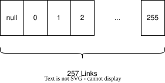
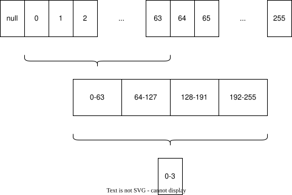

# A new concept for key value stores

Most embedded key-value stores are built around a small family of storage
structures: B-trees, B+ trees, LSM trees, and hash tables. Tries are usually
left for routing tables, dictionaries, autocomplete, and specialist string
indexes. That is not because tries are bad at lookup. It is because the obvious
way to store a trie is too sparse for a database.

Leaves explores a different point in the design space: a persistent,
copy-on-write trie whose nodes are compressed enough to live directly in durable
storage. The important claim is not merely that tries can search by key bytes.
The important claim is that a trie can become a practical database structure if
the node format solves the space problem that made traditional tries unattractive
for general-purpose storage.

This article explains that argument in three parts:

1. why tries are not usually used as databases;
2. how Leaves solves the space problem with compressed persistent trie nodes;
3. why tries give replication a natural Merkle-tree shape.

## Chapter 1: Why tries are not used as databases

A trie is a search tree where the path through the tree is determined by the
symbols of the key. For byte strings, each step consumes a byte. That gives tries
several appealing properties for key-value storage.

Lookup depends on key length, not on the number of stored records. A search does
not compare the requested key against separator keys at each tree level, and it
does not need a hash table with collision handling. Common prefixes are shared
structurally. Ordered traversal also follows naturally when child edges are kept
in byte order.

Those properties are good. They are also not enough.

The conventional database answer is the B-tree, or more commonly the B+ tree.
B-trees were designed around slow storage and fixed-size pages. Each internal
page stores many separator keys and child pointers, which gives the tree a high
fanout and a small height. A database lookup may need only a few page reads, and
each page read brings in many useful keys at once. B-trees also handle sorted
iteration well because neighboring keys are packed into pages, and decades of
database engineering have built concurrency, recovery, bulk loading, and cache
behavior around this page-oriented model.

The trie loses this comparison if it is implemented naively. A byte trie can have
up to 256 possible children per internal node. If every node stores a full
256-entry pointer array, most entries are usually empty. The database then pays
for absence: memory and disk space are spent on branches that do not exist. A
linked-list or map-of-children representation saves space, but it gives back much
of the lookup advantage through extra pointer chasing, variable node layouts, and
worse locality. Long keys can also create long chains of single-child nodes,
turning one logical key into many stored nodes.

So the blunt answer is: tries are not commonly used as databases because of
space. The direct addressing that makes a trie attractive also creates a sparse
node representation. For in-memory dictionaries that may be acceptable, and for
special domains like IP routing the prefix semantics can justify the cost. For a
general persistent key-value store, unused child slots and extra node reads are a
heavy tax.

Compressed tries, radix trees, Patricia trees, and adaptive radix trees all try
to attack this weakness. They compress empty paths, reduce child storage, or
choose different node formats depending on density. Leaves belongs to that family
of ideas, but applies the compression to a durable, mmap-friendly,
copy-on-write database layout rather than to a transient in-memory index.

## Chapter 2: How Leaves solves the space problem

Leaves stores the database as a persistent trie. Nodes are allocated in pages by
the Leaves memory manager and updates use copy-on-write: committed nodes are
immutable, and a write transaction creates new nodes for the parts of the trie it
changes. This makes the trie suitable for ACID-style snapshots and memory-mapped
storage, but it also raises the bar for node compactness. If every updated trie
node were a large 256-pointer object, persistence would amplify the classic trie
space problem.

The core Leaves node is `_TrieNode`. It uses two forms of compression at the
same time.

The first form is prefix compression. Each internal trie node stores a compressed
key segment in `_compressed_data`, with its length in `_compressed_len`. This
means a sequence of bytes with no branch point does not need one node per byte.
The cursor first checks this compressed prefix against the remaining lookup key;
only after the prefix matches does traversal continue to the next branch byte.
This is the usual radix-tree idea, but built into the persistent node format.

The second form is sparse child compression. Leaves still treats a byte as a
direct branch selector, but it does not store 256 child offsets. Instead, it uses
a two-level bitmap index:

1. `_upper` is an 8-bit bitmap. Each bit represents one group of 32 possible
   byte values: 0-31, 32-63, and so on up to 224-255.
2. `_lower[]` contains one 32-bit bitmap for each active group. A bit in a lower
   bitmap marks that the exact byte value exists as a branch.
3. the offset array stores only the child offsets for branches that actually
   exist.

Lookup stays direct. For a byte `c`, Leaves computes `ubit(c) = c >> 5` to find
the upper group and `lbit(c) = c & 0x1F` to find the bit inside that group. If
the upper bit is absent, the child does not exist. If the lower bit is absent,
the child does not exist. If both are present, Leaves uses a popcount over the
preceding set bits to find the index in the compact offset array. The result is
still O(1) child selection for one byte, but the node pays for existing branches,
not for all 256 possible branches.

This is the main shift. Leaves keeps the property that made tries attractive:
following the key through the structure without comparator-heavy tree descent.
But it removes the representation that made tries unattractive: the full child
pointer array. A sparse node with three children stores three offsets, not 256.
The upper and lower bitmaps are small enough to make the mapping fast, and the
offset array is dense enough to be persistent-storage friendly.

Leaves separates internal navigation nodes from value nodes. `_LeafNode` stores
the actual key and value bytes. Small values are stored inline. Large values can
be stored out of line by the memory manager, with a reference kept in the leaf.
That matters because a database node layout must handle both common tiny records
and occasional large values without making every normal lookup drag a large value
payload through the trie.

The performance result is not only theoretical. The benchmark article
[Can Persistent Tries Beat LMDB? Leaves Database Benchmarked](https://hackernoon.com/can-persistent-tries-beat-lmdb-leaves-database-benchmarked)
compares Leaves against LMDB and other engines with YCSB-style workloads. In
that benchmark, Leaves is faster than LMDB in several read-heavy, mixed,
batched-update, ACID, and concurrent scenarios. That is important because LMDB is
a strong B+ tree baseline: it is memory-mapped, copy-on-write, and highly tuned.
The result supports the architectural claim that a compact persistent trie can
beat a B-tree design on lookup-heavy and update-heavy workloads.

The same benchmark also shows the boundary. LMDB can still win on longer range
scans. That is exactly where B-tree page locality is strongest: once the start
key is found, adjacent records tend to sit near each other in leaf pages. Leaves'
advantage is not that tries magically dominate every workload. The advantage is
that the old objection to tries, excessive space and indirection, is no longer
fatal when the trie node is compressed and stored with a suitable memory manager.

That conclusion also matches Leaves' development history. Several locality
experiments were tried: placing allocations near parent nodes, clustering child
nodes with their parent during insertion, and clustering neighboring leaves in a
single memory block. These ideas looked plausible, but in practice they did not
pay for themselves. The extra work, especially the copying required during
clustering and page splits, cost more than the locality improvement returned.
The durable win came from a compact node representation, copy-on-write updates,
and allocator behavior that fits the persistent trie rather than trying to patch
a sparse trie after the fact.

## Chapter 3: Bonus: Replication

Tries have another property that B-trees do not expose as naturally: every
subtree has a semantic name. The path to a node is a key prefix. All keys below
that node share that prefix. If the database stores a hash for each subtree, then
that hash becomes a compact statement about all key-value pairs below the prefix.

That is the Merkle-trie idea. A Merkle tree hashes data at the leaves and hashes
children into parent hashes, producing a root hash that summarizes the whole
structure. If two peers have the same root hash, they have the same state under
that root. If the root hashes differ, the peers can descend into child hashes and
find the differing subtrees without transferring the entire database. Systems
such as Dynamo-inspired stores, Cassandra, and Riak use this style of
anti-entropy synchronization to avoid sending data that replicas already share.
Ethereum's Merkle Patricia Trie applies a related idea to blockchain state:
paths identify state entries, and hashes make the structure verifiable.

Leaves' replication uses the same structural advantage. `ReplicationDB` extends
the normal database with replication-specific state:

- the main trie stores current key-value data;
- the deletion trie stores deleted keys so removals can be replicated;
- hash tries cache subtree hashes for both the main trie and the deletion trie.

During a replication session, the sender and receiver do not blindly copy the
whole database. The sender transmits hash subtries. The receiver compares those
hashes with its local hash trie. Matching subtrees can be acknowledged and
skipped. Divergent or missing subtrees are expanded and transferred. The process
uses explicit protocol messages such as trie data, subtree acknowledgments,
big-value chunks, fraction completion, and final completion, driven by the
sender and receiver FSMs.

Leaves separates replication into phases. First, it synchronizes the main data
trie. Second, it synchronizes the deletion trie. Third, it streams deferred large
values. When the receiver has the necessary data, it applies the received state
through a staged merge and commits it atomically. For very large sessions, the
receiver can enter fraction mode: it commits a bounded chunk, asks the sender to
restart from the root, and then relies on hash comparison to skip everything that
has already converged.

This design keeps the mechanism and policy separate. Leaves provides the trie
structure, deterministic message flow, hash-based pruning, staged apply, and
atomic commit. Applications still decide the consistency model, peer topology,
retry behavior, and conflict-resolution policy.

The reason this fits so well is that a trie already divides the keyspace into
prefix subtrees. Adding hashes does not require inventing a second partitioning
scheme. The replication structure follows the storage structure.

## Conclusion

Tries were not kept out of databases because their lookup model was weak. They
were kept out because their obvious representation was too sparse. B-trees won
because they make economical use of pages, keep height low, and behave well on
storage hardware.

Leaves attacks the trie problem at the node layout. Prefix compression removes
long one-child chains. The two-level bitmap removes the 256-pointer array while
preserving fast byte selection. Copy-on-write pages make the structure
persistent. Once those pieces are in place, a trie stops being only a memory data
structure and becomes a viable database layout.

The bonus is replication. A compact persistent trie can also be a Merkle trie:
hashes summarize prefix subtrees, peers compare structure before transferring
data, and replication sends the differences rather than the database. That is
the larger concept behind Leaves: one structure for lookup, persistence,
copy-on-write updates, and synchronization.

## Sources and further reading

- [Can Persistent Tries Beat LMDB? Leaves Database Benchmarked](https://hackernoon.com/can-persistent-tries-beat-lmdb-leaves-database-benchmarked)
- [NIST Dictionary of Algorithms and Data Structures: trie](https://xlinux.nist.gov/dads/HTML/trie.html)
- [NIST Dictionary of Algorithms and Data Structures: B-tree](https://xlinux.nist.gov/dads/HTML/btree.html)
- [Wikipedia: Trie](https://en.wikipedia.org/wiki/Trie)
- [Wikipedia: B-tree](https://en.wikipedia.org/wiki/B-tree)
- [Wikipedia: Merkle tree](https://en.wikipedia.org/wiki/Merkle_tree)
- [Ethereum: Merkle Patricia Trie](https://ethereum.org/en/developers/docs/data-structures-and-encoding/patricia-merkle-trie/)
