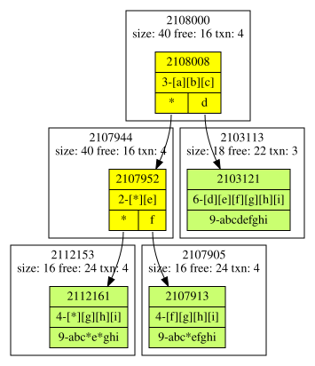

# Lessons Learned

This document captures key engineering lessons that shaped the current Leaves architecture.

## Data Locality

Several attempts were made to improve data locality for the trie nodes.

Simple Hint
: Use an allocation hint for the memory pool to find a block near the parent node.
  Result: There was no measurable change in performance.

Node Cluster
: Cluster child nodes with their parent in a single memory block during insertion.
  Result: Performance decreased significantly because the clustering operation (particularly the extra memcpy work) was more expensive than the benefit of better locality.

Cluster Leaves
: Cluster neighboring leaves together in a single memory block.
  Result: Again, the clustering operations were more expensive than the benefit of better locality. Performance decreased. Page splits with their extra memcpy work were the main culprit.

## Multithread Hash Updater

Removed because the performance gain did not justify the added code complexity. (Network transfer is the bottleneck.)

## Big Values Write

With mmap, it is better to write big values directly than to memcpy them.

## Big Values in MMAP

- When the value size exceeds a certain threshold, it is faster to write the value directly to the mmap file instead of copying it into memory first.
- The threshold differs for every system and must be determined by benchmarking. 

## 256-Array TrieNode

The basic idea was to use a bitmap to compress the pointer map of the trie node. The first obvious choice was to use a 64-bit value for compression. However, the extra work required to transform a key string into a 64-bit encoded value sabotaged performance. Counterintuitively, larger fanouts yielded better performance. The final choice was the double bitmap compression approach described in the architecture document.

### Branch Key Always Compressed

The branch key is always stored in compressed form instead of being recalculated from the TrieNode bitmaps. This approach is both easier to implement and faster: to reconstruct the key string, you only need to concatenate the compressed parts of all nodes from the root to the leaf.

## Development

### Printing Trie Structures Eases Development

Working with trie structures is a complex task. Printing the trie structure in a human-readable form proved invaluable for debugging and development. Visualizing trie structures using `tests/graph.py` was particularly helpful for understanding the structure of the trie and identifying bugs in the implementation.

**Example:**

This visualization shows how a trie adapts when keys like "abc", "e", and "ghi" are inserted and split across nodes—making it immediately apparent whether the tree structure is correct or if there are issues with node boundaries and compression logic.
