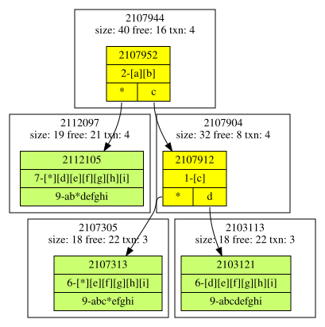

# Lessons Learned

This document captures key engineering lessons that shaped the current Leaves architecture.

## Data Locality

Several approaches were explored to improve data locality for trie nodes.

### Simple Hint

Use allocation hints in the memory pool to place new blocks near the parent node.
Result: No measurable performance improvement.

### Node Cluster

When inserting, cluster child nodes with their parent in a single memory block.
Result: Performance decreased significantly. The clustering operation, especially the additional `memcpy` work, was more expensive than the locality benefit.

### Cluster Leaves

Cluster neighboring leaves into a single memory block.
Result: Clustering overhead again outweighed locality gains, and performance decreased. Page splits in particular were costly due to extra `memcpy` work.

## Multithread Hash Updater

Removed because the performance gain did not justify the additional code complexity. Network transfer remained the bottleneck.

## Big Values in MMAP

- When value size exceeds a certain threshold, writing directly to the mmap file is faster than copying into memory first.
- This threshold is system-dependent and must be determined by benchmarking.

## 256-ary Trie Node

At the beginning of the project, multiple fanout sizes were tested (for example, 64). The space savings from smaller fanouts did not justify the additional complexity and performance cost of bit-conversion logic. A fanout of 256 provided the best balance between space usage and performance.

### Branch Key Always in Compressed Prefixes

Code complexity was reduced significantly by storing branch key segments directly in each child node’s compressed prefix, rather than reconstructing them from bit representations. To obtain a full key, concatenate the compressed segments along the node path.

### Printing Trie Structures Eases Development

A very helpful development tool was the dumper in `_check.hpp`, which prints trie structures in YAML format. The `graph.py` tool then visualizes those structures.

