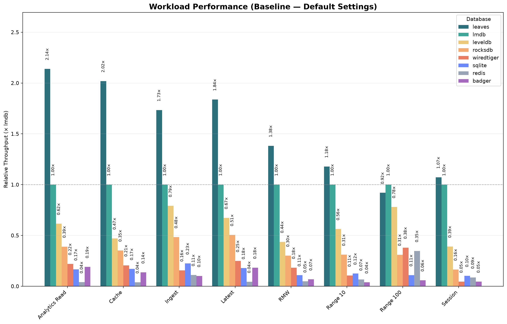
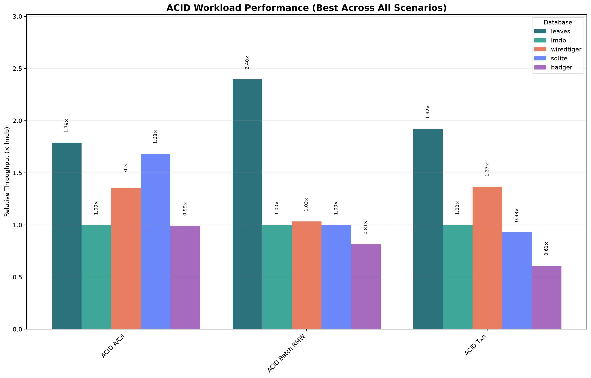
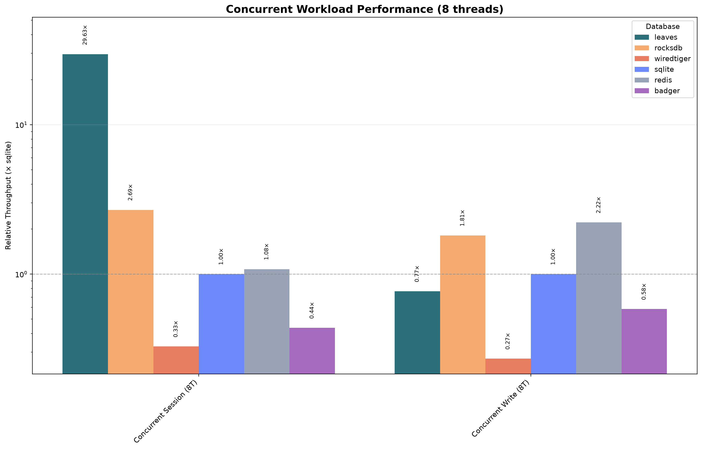
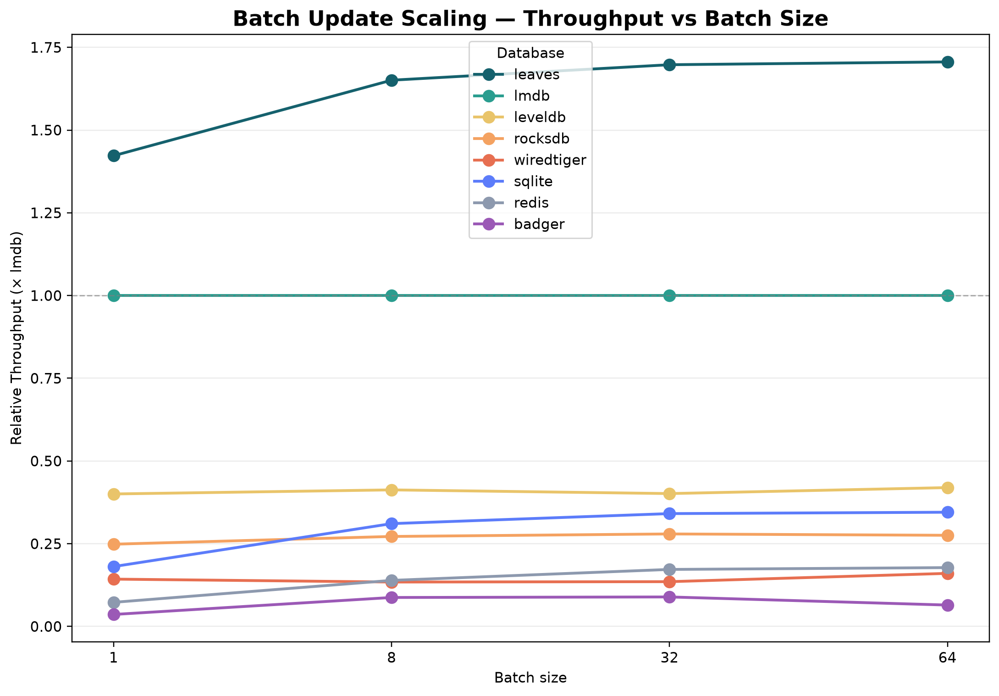
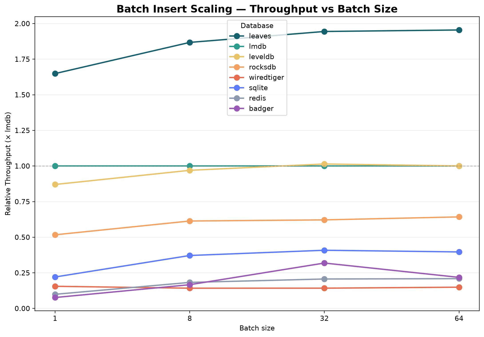

# The Fastest Key-Value Store? A Fair Fight Against LMDB

“The fastest key-value store” is a common claim in the database world.

Yet most published benchmarks avoid a direct comparison with LMDB — even though it is widely regarded as one of the fastest embedded key-value stores available. Without including LMDB, it is unclear what “fast” actually means.

This benchmark explicitly includes LMDB as the baseline and compares it against a range of modern engines.

All databases are configured for their **maximum achievable performance** using comparable settings where possible. This includes batching, cache sizing, binary keys, and other engine-specific optimizations. ACID workloads are evaluated separately with strict durability enabled.

The goal is simple: measure how these systems perform against a known high-performance reference.

The result challenges common assumptions: even LMDB is consistently outperformed.

---

## Results

Across all workloads, a clear performance hierarchy emerges. LMDB is consistently several times faster than traditional embedded competitors and reaches up to approximately **6× higher throughput** than WiredTiger and SQLite in read-heavy workloads, and about **2–4× faster** than LevelDB and RocksDB in single-threaded scenarios. Despite its reputation, RocksDB shows lower throughput than LevelDB in these single-threaded scenarios and only demonstrates its strengths under concurrent workloads, where it scales more effectively and narrows the gap. WiredTiger is consistently limited by internal overhead, while Redis is dominated by network round-trip costs rather than storage performance.

At the same time, a new competitor appears: Leaves. Using a persistent trie design with copy-on-write storage, it exceeds the performance of all other engines. Compared to LMDB, it achieves roughly **1.5–2× higher throughput** in most standard workloads and up to **2–3× in concurrent scenarios**, while in ACID workloads the difference becomes much larger, reaching over **two orders of magnitude** due to different durability strategies.

---

Leaves consistently leads across workloads, with the largest gains in read-heavy and concurrent scenarios, while LMDB remains the strongest B-tree baseline.

---

## Benchmark fairness

All systems were configured for maximum throughput using recommended settings where available. This includes cache sizing, batching, and binary keys. ACID workloads are evaluated separately with full durability enabled.

The goal is not to compare default configurations, but to measure the achievable performance of each system under comparable conditions.

---

## Why tries were not used in storage engines

Trie-based data structures have been known for decades, but have not been used in general-purpose storage engines due to their memory overhead.

A naive trie node with a fanout of 256 stores a pointer for every possible child. In sparse trees, most of these pointers are unused. For example, a node with only two children still requires 256 pointers, wasting significant memory (e.g. 254 × 8 bytes per node).

Leaves avoids this problem by using a sparse node representation:

- Radix compression merges linear paths and reduces tree depth  
- Bitfield indexing stores only pointers for existing children  

This shifts node size from fixed fanout to data-dependent size, eliminating wasted pointers in sparse nodes and making trie-based indexing viable for high-performance storage engines.

Unlike LSM trees, which trade read performance for write efficiency via multiple levels, the trie structure maintains a single searchable structure without read amplification.

---

## The Contenders

| Engine | Type | Architecture |
| --- | --- | --- |
| [LMDB](https://symas.com/lmdb/) | Embedded | B+ tree, memory-mapped, copy-on-write |
| [LevelDB](https://github.com/google/leveldb) | Embedded | LSM tree, SSTables |
| [RocksDB](https://rocksdb.org/) | Embedded | LSM tree (optimized LevelDB fork) |
| [WiredTiger](https://www.mongodb.com/try/download/wiredtiger) | Embedded | B-tree / LSM hybrid |
| [SQLite](https://www.sqlite.org/) | Embedded | B-tree with SQL layer |
| [BadgerDB](https://github.com/dgraph-io/badger) | Embedded | LSM + value log (Go via CGo) |
| [Redis](https://redis.io/) | Client/Server | In-memory hash tables |
| [Leaves](https://github.com/kochelmonster/leaves) | Embedded | Trie-based, memory-mapped, copy-on-write |

---

## Workload Scenario Breakdown

### Analytics Read (100% read)

**Scenario:**  
This workload represents read-only serving layers such as feature stores, recommendation systems, and profile lookup services, where precomputed data is accessed at high rates with strong locality.

**Configuration:**  
The workload uses `readproportion=1.0` with a zipfian distribution over one million records. RocksDB and LevelDB use a 1 GB block cache (`rocksdb.cache_size`, `leveldb.cache_size`). WiredTiger is forced into B-tree mode by disabling LSM parameters. Binary keys are enabled where supported.

- Dataset: 1,000,000 records
- Operations: 500,000
- Key size: 8 B (binary)
- Value size: 1 KB (10×100 B)

**Explanation:**  
Performance is dominated by lookup cost. LSM engines must consult multiple structures, while B-tree engines require logarithmic traversal with comparator overhead, resulting in a cost of O(k · log n). The trie-based structure used by Leaves performs lookups in O(k), depending only on key length and independent of dataset size. This removes both comparator overhead and dataset-dependent scaling, resulting in a simpler and faster lookup path. Leaves and LMDB therefore lead, with LSM engines following.

---

### Batch Insert

**Scenario:**  
Represents buffered ingestion systems such as event batching, log aggregation, or bulk data import pipelines.

**Configuration:**  
Uses `insertproportion=0.80`, `updateproportion=0.15`, `readproportion=0.05`, `insertorder=hashed`, batch sizes (`batch_size ∈ {1,8,32,64}`), and binary keys.

- Dataset: 1,000,000 records
- Operations: 1,000,000
- Key size: 8 B (binary)
- Value size: 1 KB (10×100 B)

**Explanation:**  
Batching amortizes commit and synchronization costs across multiple operations. LSM engines benefit from write buffering and sequential I/O, while B-tree engines must still locate the insertion position and perform structural updates for each insert. For copy-on-write engines such as LMDB and Leaves, batching reduces the number of copy-on-write operations by grouping multiple updates into a single transaction, significantly reducing data duplication and write amplification.

---

### Batch Update

**Scenario:**  
Represents bulk modification workloads such as periodic state updates, counter refreshes, or large-scale metadata updates.

**Configuration:**  
Uses `updateproportion=0.80`, `readproportion=0.20`, zipfian distribution, batch sizes (`batch_size ∈ {1,8,32,64}`), and binary keys.

- Dataset: 1,000,000 records
- Operations: 1,000,000
- Key size: 8 B (binary)
- Value size: 1 KB (10×100 B)

**Explanation:**  
Batching reduces commit overhead by grouping updates into fewer transactions. LSM engines still incur write amplification as updates propagate through levels, while B-tree engines must perform structural updates per operation. For copy-on-write engines such as LMDB and Leaves, batching reduces copy-on-write operations, allowing multiple updates to be applied within a single version of the data.

---

### Cache (95% read / 5% update)

**Scenario:**  
This workload models metadata and profile lookup services with a small number of frequently accessed keys.

**Configuration:**  
Uses `readproportion=0.95` with zipfian distribution. RocksDB and LevelDB use 1 GB cache. WiredTiger operates in B-tree mode. No batching is applied.

- Dataset: 1,000,000 records
- Operations: 2,000,000
- Key size: 8 B (binary)
- Value size: 1 KB (10×100 B)

**Explanation:**  
Same lookup-dominated behavior as **Analytics Read**; see above for structural differences (LSM vs B-tree vs trie).

---

### Ingest (70% insert / 20% update / 10% read)

**Scenario:**  
Represents event ingestion pipelines such as logging and telemetry systems.

**Configuration:**  
Uses `insertproportion=0.70` with uniform distribution and `insertorder=hashed`. Batching (`batch_size=64`) and binary keys are enabled across engines.

- Dataset: 1,000,000 records
- Operations: 1,000,000
- Key size: 8 B (binary)
- Value size: 1 KB (10×100 B)

**Explanation:**  
Write throughput dominates. LSM engines benefit from sequential write buffering, while B-tree engines must locate the insertion position and perform structural updates on each write. The trie-based structure used by Leaves finds the insertion position in O(k) time and avoids rebalancing or restructuring operations required by B-trees. This reduces the per-insert overhead and leads to consistently higher throughput.

---

### Latest (95% read / 5% insert)

**Scenario:**  
Models recency-biased systems such as activity feeds and monitoring dashboards.

**Configuration:**  
Uses `requestdistribution=latest`. RocksDB and LevelDB use 1 GB cache. WiredTiger operates in B-tree mode.

- Dataset: 1,000,000 records
- Operations: 1,000,000
- Key size: 8 B (binary)
- Value size: 1 KB (10×100 B)

**Explanation:**  
Same lookup/update trade-offs as **Ingest** and **Analytics Read**; locality helps LSM, but trie lookup still avoids comparator overhead.

---

### RMW (Read-Modify-Write)

**Scenario:**  
Represents counters and mutable records where each operation reads and updates data.

**Configuration:**  
Uses `readproportion=0.50` and `readmodifywriteproportion=0.50`. RocksDB and LevelDB use 1 GB cache. WiredTiger operates in B-tree mode.

- Dataset: 1,000,000 records
- Operations: 1,000,000
- Key size: 8 B (binary)
- Value size: 1 KB (10×100 B)

**Explanation:**  
Combination of **Analytics Read** (lookup) and **Ingest** (write path); see those sections for details.

---

### Range 10

**Scenario:**  
Represents short pagination queries and recent history lookups.

**Configuration:**  
Uses fixed scan length of 10 with zipfian distribution. RocksDB and LevelDB use 1 GB cache. WiredTiger uses B-tree mode with larger leaf pages.

- Dataset: 1,000,000 records
- Operations: 1,000,000
- Key size: 8 B (binary)
- Value size: 1 KB (10×100 B)

**Explanation:**  
This workload is still largely dominated by the lookup cost of the starting key, as only a small number of subsequent entries are scanned. LSM engines incur additional overhead due to merging across levels during iteration, while B-tree engines benefit from ordered leaf traversal once the starting point is found. The trie-based structure used by Leaves provides faster lookup of the starting key, but offers less advantage during sequential traversal. As a result, performance reflects a balance between lookup efficiency and short-range scan cost.

---

### Range 100

**Scenario:**  
Represents larger scans such as batch export or analytics queries.

**Configuration:**  
Same as Range 10 but with scan length 100.

- Dataset: 1,000,000 records
- Operations: 500,000
- Key size: 8 B (binary)
- Value size: 1 KB (10×100 B)

**Explanation:**  
As scan length increases, traversal cost and data locality become dominant factors. LSM engines incur additional overhead due to multi-level merging during scans. B-tree engines benefit from strong data locality, as records are stored in contiguous pages, allowing efficient sequential access once the scan begins. While the trie-based structure used by Leaves provides faster random access to the scan start, its layout is less optimized for long sequential scans. As a result, LMDB outperforms Leaves in this workload: for short ranges, the faster lookup compensates for scan cost, but for larger ranges, the data locality advantage of LMDB becomes dominant.

---

### Session (50% read / 50% update)

**Scenario:**  
Models user session storage with frequent reads and updates.

**Configuration:**  
Uses `readproportion=0.50` and `updateproportion=0.50` with batching and binary keys enabled. RocksDB and LevelDB use 1 GB cache. WiredTiger operates in B-tree mode.

- Dataset: 5,000,000 records
- Operations: 5,000,000
- Key size: 8 B (binary)
- Value size: 1 KB (10×100 B)

**Explanation:**  
Mixed workload; combines effects described in **Analytics Read** and **Ingest**.
To be compareable with the **Concurrent Session** scenatrio, it has the same total number of operations, but is executed single-threaded.

---

### ACID A/C/I

**Scenario:**  
This workload models transactional update patterns under strict durability constraints. Each operation consists of a mix of reads, updates, and read-modify-write operations (25% reads, 35% updates, 40% RMW) executed with full synchronization guarantees. It approximates systems that require atomic updates to individual records while maintaining consistency and isolation.

**Configuration:**  
Durability is enforced via database-specific settings: LMDB disables `nosync`, RocksDB enables `sync`, WiredTiger enables transactional fsync, SQLite uses WAL and full sync, and Leaves enables WAL.

- Dataset: 100,000 records
- Operations: 400,000
- Key size: 8 B (binary)
- Value size: 1 KB (10×100 B)

**Explanation:**  
Durability dominates; same fsync/logging effects as in **ACID Transactions**.

---

### ACID Transactions

**Scenario:**  
This workload models explicit multi-key transactions. Each operation executes a transaction that reads multiple keys and updates them atomically within a single commit. The workload therefore measures the cost of coordinating multi-key updates under strict durability and isolation guarantees, similar to financial transfers or strongly consistent state transitions.

**Configuration:**  
Uses `transactionmode=multikey_acid` with strict durability settings.

- Dataset: 100,000 records
- Operations: 200,000
- Key size: 8 B (binary)
- Value size: 1 KB (10×100 B)

**Explanation:**  
Same durability and coordination costs as **ACID A/C/I**, with additional multi-key overhead.

---

### ACID RMW

**Scenario:**  
This workload models batched atomic read-modify-write transactions across multiple keys. Each transaction performs 8 read-modify-write pairs in one commit, exercising multi-key atomicity and rollback behavior under strict durability guarantees. It approximates real-world patterns such as fund transfers across accounts, coordinated inventory adjustments across SKUs, or multi-document patching in one transaction.

**Configuration:**  
Uses `readmodifywriteproportion=1.0` with `batch_size=8`, zipfian key access (`requestdistribution=zipfian`), and hashed key insertion (`insertorder=hashed`, `hashalgo=sha256`). RocksDB and LevelDB are configured with 1 GB cache (`rocksdb.cache_size`, `leveldb.cache_size`) to cover the working set. WiredTiger is forced to B-tree mode by disabling LSM parameters.

- Dataset: 1,000,000 records
- Operations: 10,000
- Key size: 8 B (binary)
- Value size: 1 KB (10×100 B)

**Explanation:**  
Each transaction contains 8 RMW pairs (8 reads + 8 writes, 16 DB calls total), so 10,000 operations correspond to 1,250 transactions. Throughput is primarily determined by durability and transaction coordination cost: each commit must synchronize persistent state while preserving all-or-nothing semantics across multiple keys. Compared to non-transactional RMW, this adds commit and rollback overhead on top of the read-before-write path.

---

### Concurrent Session (8 threads)

**Scenario:**  
Represents multi-threaded web backends handling user sessions.

**Configuration:**  
Uses `threadcount=8`. Leaves uses `confluence` format. RocksDB uses 2 GB cache. WiredTiger uses 4 GB cache and B-tree mode.

- Dataset: 2,000,000 records
- Operations: 2,000,000
- Key size: 8 B (binary)
- Value size: 1 KB (10×100 B)

**Explanation:**  
Concurrency introduces contention. LMDB serializes writes, limiting scalability. RocksDB benefits from concurrent write support. Leaves isolates writes per thread and merges asynchronously, achieving higher scalability.

---

### Concurrent Write (8 threads)

**Scenario:**  
Represents high-throughput ingestion systems with many parallel writers.

**Configuration:**  
Uses `insertproportion=0.70` and `threadcount=8`. Leaves uses `confluence` format and large mapsize. RocksDB and WiredTiger increase cache sizes.

- Dataset: 2,000,000 records
- Operations: 2,000,000
- Key size: 8 B (binary)
- Value size: 1 KB (10×100 B)

**Explanation:**  
Write scalability depends on contention. LSM engines scale via buffering but still share structures. B-tree engines are limited by centralized updates. Leaves distributes writes across threads and merges them asynchronously, resulting in superior scalability.

---

## Benchmark

### Benchmark framework

Benchmarks are executed using a modified YCSB-cpp:
[https://github.com/kochelmonster/YCSB-cpp](https://github.com/kochelmonster/YCSB-cpp)

Supports:

- scenario matrix (batch, ACID, concurrent)  
- per-database tuning  
- reproducibility  

#### 1. Raw throughput extraction (per run)

For each `(database, scenario, workload, repeat)` tuple, the runner executes a load phase and a run phase. The plotted metric comes from the run phase log line:

`Run throughput(ops/sec): <value>`

Only this run-phase throughput value is used for the matrix and graphs.

#### 2. Repeat aggregation (single value per tuple)

If `BENCHMARK_REPEATS=1`, that single run throughput is used directly.

If `BENCHMARK_REPEATS>1`, all repeat throughput values for the tuple are sorted and aggregated with the median:

- Odd count: middle value
- Even count: average of the two middle values

This aggregated value becomes `run_throughput_ops_sec` for that tuple.

#### 3. Matrix CSV semantics

The runner writes `throughput_matrix_<timestamp>.csv` with one row per tuple:

`scenario,batch_size,workload,database,run_throughput_ops_sec`

So each row already represents a single aggregated throughput value (single run or median across repeats).

#### 4. Chart aggregation from the matrix

`create_benchmark_graphs.py` reads the matrix CSV and builds pivots with `aggfunc=max` (or equivalent `groupby(...).max()`):

- Baseline comparison chart:
  - filter `scenario == baseline`
  - pivot by `(workload_label, database)`
  - cell value = max throughput for that pair
- Batch scaling charts:
  - filter `scenario` matching `batch_insert_*` or `batch_update_*`
  - pivot by `(batch_size, database)`
  - cell value = max throughput
- Value-size scaling chart:
  - filter `scenario` matching `value_size_*`
  - pivot by `(value_size, database)`
  - cell value = max throughput
- ACID and Concurrent comparison charts:
  - filter by workload label groups
  - group by `(workload_label, database)`
  - cell value = max throughput across included scenarios

#### 5. Normalization used in plotted y-values

When possible, chart values are normalized row-wise to a reference database:

`normalized_value = throughput(database) / throughput(reference_db)`

Reference selection order in code is:

1. `lmdb`
2. `sqlite`

If neither is present, charts use absolute `ops/sec` values.

#### 6. Raw vs normalized outputs

- The PNG graphs may show normalized ratios (for example `1.75x`).
- The sidecar CSV files written next to each graph store the raw pivot values before normalization.

---

### Benchmark overhead

Modern key-value stores can be so fast that even small benchmark overheads distort the results.

To quantify this, the same workloads were profiled against LMDB using both the original and optimized YCSB-cpp versions. Using Linux `perf` with per-shared-object attribution, the fraction of application CPU time spent inside the database versus the benchmark framework was measured.

| Workload | Version | DB time | Framework time | Framework overhead |
| --- | --- | --- | --- | --- |
| Analytics Read | Original | 37.5% | 23.5% | **38.5%** |
| Analytics Read | Optimized | 57.2% | 8.4% | **12.8%** |
| RMW | Original | 37.6% | 23.1% | **38.0%** |
| RMW | Optimized | 53.6% | 11.2% | **17.3%** |
| Batch Insert | Original | 27.8% | 25.4% | **47.8%** |
| Batch Insert | Optimized | 28.7% | 24.9% | **46.5%** |

Framework overhead = Framework / (Framework + DB)

In read-heavy workloads, the unoptimized benchmark wastes nearly 40% of application CPU time outside the database. After optimization, this drops to roughly 13–17%.

Batch insert workloads show similar overhead in both versions because commit cost dominates, making framework overhead relatively less visible.

#### Throughput impact

| Workload | Original YCSB-cpp | Optimized YCSB-cpp | Speedup |
| --- | --- | --- | --- |
| Analytics Read | 782,150 ops/sec | 1,129,890 ops/sec | **1.44×** |
| RMW | 402,996 ops/sec | 610,086 ops/sec | **1.51×** |
| Batch Insert | 176,398 ops/sec | 193,318 ops/sec | 1.10× |

#### How overhead biases comparisons

Benchmark overhead adds a roughly constant per-operation cost.

- Faster databases complete their work quickly → overhead becomes a larger fraction
- Slower databases spend more time in actual work → overhead is less visible

This compresses the apparent performance gap.

Example (LMDB vs LevelDB):

| Benchmark | LMDB ops/sec | LevelDB ops/sec | Ratio |
| --- | --- | --- | --- |
| Original | 782,150 | 474,798 | **1.65×** |
| Optimized | 1,129,890 | 622,623 | **1.81×** |

The unoptimized benchmark underestimates the true performance difference. This effect applies to all fast engines.

All results in this article use the optimized benchmark to ensure measurements reflect actual database performance rather than framework artifacts.

---

### Test-System

- CPU: i7-12700KF  
- RAM: 32 GB DDR4  
- NVMe KINGSTON SNV2S2000G
- OS: Ubuntu 24.04.4
- Filesystem: ext4 with default settings (barrier=1, journaling enabled)
- Kernel: 6.8.0-31-generic
---

## Architecture and Capabilities of Leaves

Leaves is based on a persistent trie structure combined with copy-on-write storage and a concurrency model designed for parallel workloads. More details can be found in the [Leaves documentation](https://github.com/kochelmonster/leaves).

**Trie-based indexing** O(k) lookup independent of dataset size; avoids comparator-based traversal.

**Copy-on-write and batching** Persistent structure with batched updates to reduce write amplification.

**Memory-mapped storage** Direct access via OS paging without a separate buffer manager.

**Confluence concurrency model** Per-thread write isolation with asynchronous merging.

**Merkle-trie replication** Replication uses a separate hash trie, enabling efficient synchronization without affecting normal operation.

**Efficient set operations** Merge and intersection operate directly on the trie structure with structural sharing.

**Header-only implementation** No separate build or linking step; easy embedding.

**Browser execution via WebAssembly** Runs in the browser using IndexedDB as backend with the same data structure.

---

## Conclusion

LMDB remains a strong baseline for embedded databases.

However, this benchmark shows that a fundamentally different design — a persistent trie — can outperform both B-tree and LSM-based systems across a wide range of workloads.

This result follows directly from architectural differences in lookup, write path, and concurrency.