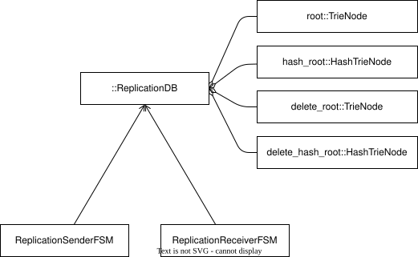
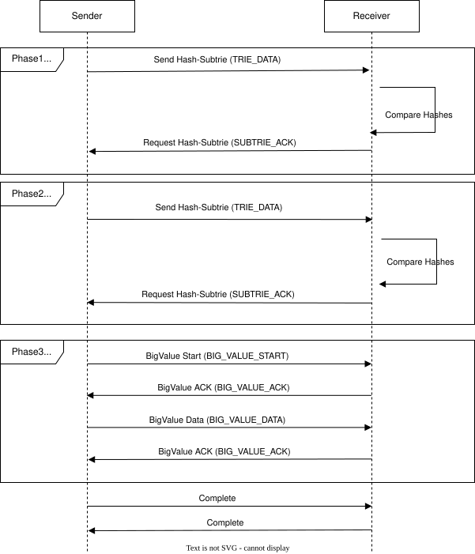

# Leaves Replication Framework

This document describes the replication framework in Leaves.

For a complete runnable peer-to-peer example, see
[examples/p2p_kv/README.md](/examples/p2p_kv/README.md).

## What Leaves replication is and is not

### Leaves replication is not a consensus system

Leaves does not provide:

- Leader election
- Quorum management
- Distributed consensus
- Automatic conflict-resolution policy
- A predefined global consistency model

### What Leaves does provide

Leaves provides:

- A transport-independent replication state machine (FSM)
- Mechanism-level atomicity for staged receiver apply and commit
- Deterministic replication mechanics and message ordering
- Serialization of replication events and payloads
- Application of remote changes
- Extension points via Aspects and handlers/policies

This design follows the mechanism-policy split:

- Leaves implements replication mechanism, including atomic and deterministic behavior at the protocol and apply layers.
- Applications implement consistency policy and conflict-resolution strategy.

## Architecture



Core components:

- Public replication API wrappers
- Replication-capable DB wrapper (`ReplicationDB`) with main trie and
  deletion trie
- Sender and receiver FSMs
- Replication protocol message definitions
- Transfer trie serialization and chunk transfer support
- Merge and overwrite policy hooks

Code anchors:

- [include/leaves/replication.hpp](/include/leaves/replication.hpp)
- [include/leaves/intern/replication/_replication_fsm.hpp](/include/leaves/intern/replication/_replication_fsm.hpp)
- [include/leaves/intern/replication/_replication_protocol.hpp](/include/leaves/intern/replication/_replication_protocol.hpp)
- [include/leaves/intern/replication/_transfer.hpp](/include/leaves/intern/replication/_transfer.hpp)
- [include/leaves/intern/replication/_replication_db.hpp](/include/leaves/intern/replication/_replication_db.hpp)

## ReplicationDB data model

`ReplicationDB` extends the regular trie with a second trie used only for
deletions.

- Main trie: key/value data.
- Deletion trie: deleted keys replicated to peers.
- Hash tries: an additional replication hash cache is stored for both main and
  deletion tries and used for subtree hash comparison during sync.
- Deletion entries store a timestamp and optional metadata.

### Deletion retention and purge

Deletion markers are periodically removed to cap growth.

- `set_retention(seconds)` configures how long deletion markers are kept.
- Entries older than `retention_seconds` are removed by the background purge
  job.
- Default retention is `86400` seconds (24 hours).

## Replication lifecycle

This section is a high-level session view. Detailed phase behavior is defined
in [Replication pipeline](#replication-pipeline), and protocol message types
are listed in [Message exchange](#message-exchange).

1. Source commits local changes and starts a sender session.
2. Sender and receiver progress through the pipeline phases in deterministic
   order.
3. Receiver buffers incoming phase data and may commit intermediate fractions
   when memory pressure requires it.
4. On completion, receiver merges and commits pending data atomically.
5. Both sides finalize the session or transition to `ERR` if a protocol/runtime
   error occurs.

## Replication pipeline



The pipeline is the canonical flow for one replication session.

It has three explicit phases:

1. Main-Data replication

    - Sender transmits hash subtries of the main data trie.
    - Receiver compares subtree hashes, applies changed/missing nodes, and
      requests next needed subtries.
    - Small values are transferred inline; large values are deferred to phase 3.

2. Deleted-Items replication

    - Sender transmits hash subtries of the deletion trie.
    - Receiver compares against local deletion trie state, applies
      changed/missing nodes, and requests next needed subtries.


3. Big Value transfer

    - Sender streams deferred large-value payloads using chunked big-value messages.
    - Receiver drives chunk progress with acknowledgments until all deferred payloads are anchored and complete.

After phase 3, sender emits `COMPLETE`; receiver then performs final merge/apply and commit.

## Message exchange

Protocol message inventory (independent of section narrative):

- Sender -> receiver: `TRIE_DATA`, `BIG_VALUE_START`, `BIG_VALUE_DATA`,
  `COMPLETE`, `ERR`
- Receiver -> sender: `SUBTRIE_ACK`, `BIG_VALUE_ACK`, `FRACTION_COMPLETE`,
  `ERR`

## Receiver apply and atomicity

Receiver apply is staged and then committed atomically.

- Incoming wire payloads are held in temporary in-memory buffers.
- Main and deletion phases are accumulated as needed.
- At completion, receiver merges and commits all pending received data in one
  merge transaction.

This atomicity is a mechanism-level guarantee: Leaves ensures that a session reaches a consistent committed state in a deterministic way. The application still chooses the consistency policy and conflict-resolution strategy that determine how competing updates are interpreted and ordered.

## Fraction mode for large sessions

Receiver temporary memory is bounded by a configurable threshold (`memory_budget`).

- If buffered temporary receive data exceeds that threshold and progress was   made, receiver sends `FRACTION_COMPLETE`.
- Receiver then commits the current fraction and asks sender to restart from   root for the next fraction.
- This is a normal continuation path for large transfers, not an error.


## Synchronization model

Synchronization is incremental and deterministic per session:

- Sender and receiver progress by explicit message transitions.
- Ordering is controlled by FSM transitions and message typing.
- Sessions may complete in one pass or in multiple committed fractions under memory pressure.
- Applications decide scheduling, retries, and peer topology.

## Transport abstraction

Replication logic does not assume TCP, WebSocket, QUIC, or shared memory.

The transport contract is abstracted through send/receive callbacks and error/event propagation. Applications can bind the same replication mechanism to different transports.

## Extensibility

Extensibility points include:

- Aspect hooks for cross-cutting instrumentation and behavior injection
- Merge/overwrite policy handlers
- Application-level conflict resolution policies

Code anchors:

- [include/leaves/intern/db/_aspect.hpp](/include/leaves/intern/db/_aspect.hpp)
- [include/leaves/intern/util/_merger.hpp](/include/leaves/intern/util/_merger.hpp)

## Implementing conflict resolution strategy

Leaves does not resolve write conflicts for you. It provides the mechanism for deterministic replication and atomic apply, but applications must define their consistency policy and conflict-resolution strategy. A typical strategy is:

1. Define domain conflict keys and ordering metadata.
2. Implement overwrite/merge policy callbacks.
3. Apply deterministic rules (for example version vectors, timestamp + tie-break key, or domain-priority ordering).
4. Record decisions for auditability where required.

### Example: deterministic last-writer-wins by logical version

```cpp
struct VersionedPolicy {
  bool may_overwrite(leaves::Slice key,
                     leaves::Slice dst_value,
                     leaves::Slice src_value) {
    auto dst_v = decode_version(dst_value);
    auto src_v = decode_version(src_value);
    return src_v >= dst_v;
  }
};
```

### Example: domain merge policy

```cpp
struct AccountBalancePolicy {
  bool may_overwrite(leaves::Slice key,
                     leaves::Slice dst_value,
                     leaves::Slice src_value) {
    auto dst = decode_account(dst_value);
    auto src = decode_account(src_value);
    if (src.ledger_epoch != dst.ledger_epoch) {
      return src.ledger_epoch > dst.ledger_epoch;
    }
    return src.sequence > dst.sequence;
  }
};
```

### Example: transport binding sketch

```cpp
struct WsTransport : ReplicationTransport {
  bool send(leaves::Slice bytes) override {
    return websocket_send(bytes.data(), bytes.size());
  }
};
```

## Related documents

- [docs/architecture/architecture.md](/docs/architecture/architecture.md)
- [docs/cpp-api.md](/docs/cpp-api.md)
- [docs/js-api.md](/docs/js-api.md)
- [docs/lessons-learned/lessons-learned.md](/docs/lessons-learned/lessons-learned.md)
- [docs/performance/performance.md](/docs/performance/performance.md)
